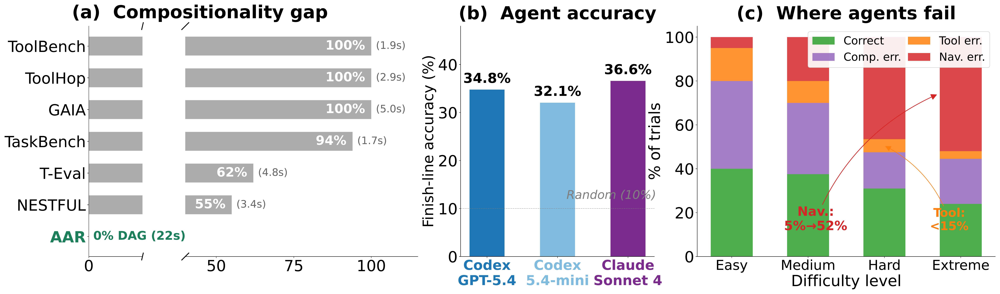
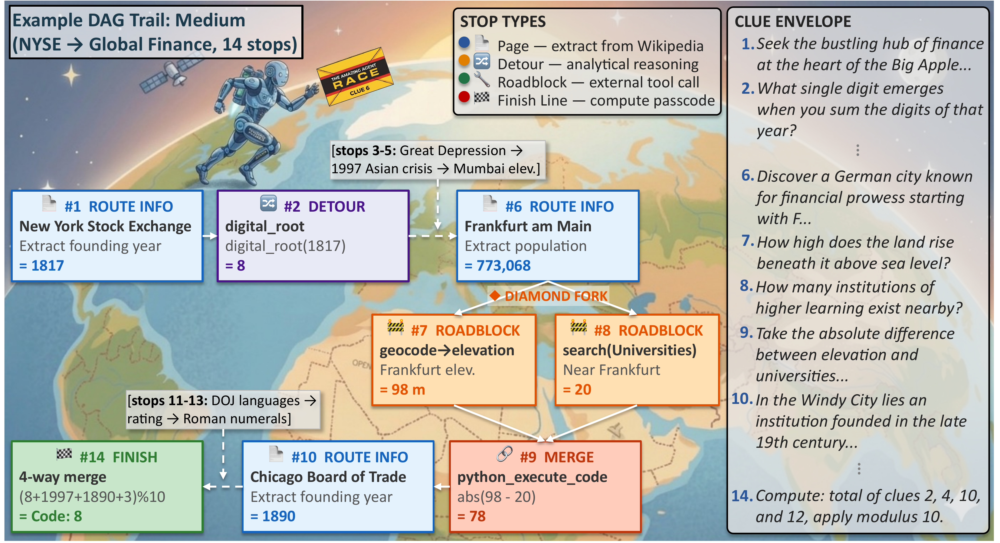
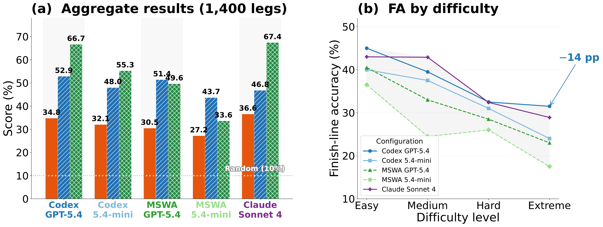
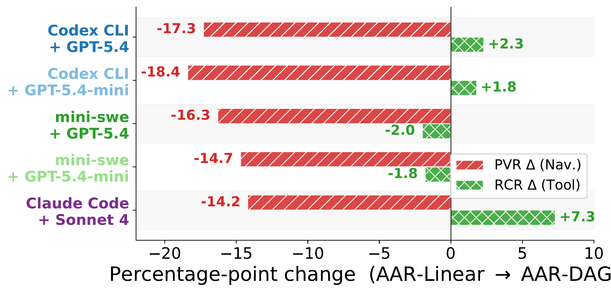

<h1 align="center">The Amazing Agent Race</h1>

<h3 align="center">Strong Tool Users, Weak Navigators</h3>

<p align="center">
  <a href="https://github.com/minnesotanlp/the-amazing-agent-race"></a>
  <a href="https://arxiv.org/abs/2604.10261"></a>
  <a href="https://registry.harborframework.com/datasets/minnesotanlp/aar/latest"></a>
  <a href="LICENSE.md"></a>
</p>

<p align="center">
  <b>AAR</b> is a benchmark of <b>1,400 DAG-structured scavenger-hunt puzzles</b> for evaluating LLM agents on multi-step tool use, web navigation, and arithmetic reasoning.
</p>

<p align="center">
  
</p>

<p align="center">
  <em>(a) Existing benchmarks are 55--100% linear; AAR is 0% linear (all DAGs). (b) Best agent accuracy is 36.6%. (c) Navigation errors dominate (27--52%) while tool-use errors stay below 17%.</em>
</p>

---

## Key Findings

- **Agents are strong tool users but weak navigators.** Navigation errors dominate (27--52% of trials) while tool-use errors stay below 17%. The bottleneck is *reaching* the right information, not using tools once found.
- **Compositional structure amplifies the navigation gap.** Moving from linear to DAG structure drops navigation scores (PVR) by 14--18 pp while tool-use scores (RCR) stay stable or even improve.
- **Agent architecture matters as much as model scale.** Claude Code matches Codex CLI at ~37% accuracy with **6x fewer tokens**. The framework gap is larger than the model-scale gap.
- **Reasoning models fail under time constraints.** A 120B reasoning model achieves only 3.1% accuracy --- barely above the 10% random baseline --- spending its budget on internal reasoning instead of tool calls.

## Example Puzzle

Each puzzle (called a *leg*) presents the agent with a seed Wikipedia URL, a cryptic riddle, and 19 tools. The agent must navigate pages, call APIs, and compute a single-digit passcode (0--9).

<p align="center">
  
</p>

<p align="center">
  <em>An example clue envelope as presented to the agent: a DAG trail themed "NYSE to Global Finance" with 14 stops, showing route info, detour, roadblock, diamond fork, merge, and finish-line stops.</em>
</p>

## Results

### Aggregate Performance (1,400 legs)

<p align="center">
  
</p>

<p align="center">
  <em>(a) FA (finish-line accuracy), PVR (navigation), RCR (tool use) across all configurations. PVR is consistently the weakest metric. (b) FA degrades monotonically with difficulty (-14 pp best to -19 pp worst).</em>
</p>

| Configuration | FA | PVR (Nav.) | RCR (Tool) |
|---|---|---|---|
| Codex CLI + GPT-5.4 | 34.8% | 52.9% | 66.7% |
| Codex CLI + GPT-5.4-mini | 32.1% | 48.0% | 55.3% |
| mini-swe-agent + GPT-5.4 | 30.5% | 51.4% | 43.7% |
| mini-swe-agent + GPT-5.4-mini | 27.2% | -- | -- |
| **Claude Code + Sonnet 4** | **36.6%** | **46.8%** | **67.4%** |

### DAG Structure Penalizes Navigation, Not Tool Use

<p align="center">
  
</p>

<p align="center">
  <em>Percentage-point change from AAR-Linear to AAR-DAG. Navigation (PVR) drops 14--18 pp while tool use (RCR) remains stable or increases.</em>
</p>

## Benchmark Overview

AAR releases **two variants** totaling 1,400 legs:

| Variant | Legs | Structure | Avg Stops | Avg Tools |
|---------|------|-----------|-----------|-----------|
| **AAR-Linear** | 800 | Sequential chains | 15.0 | 4.0 |
| **AAR-DAG** | 600 | Fork-merge diamonds | 22.1 | 12.0 |

### Difficulty Levels

AAR ships with 4 difficulty levels, but the generation pipeline is fully adjustable -- you can define custom levels by varying pit-stop count, roadblock density, detour frequency, diamond count, extraction type, and crawl depth.

| Level | Pit Stops | Roadblocks | Detours | Diamonds | Extraction | Crawl Depth |
|-------|-----------|------------|---------|----------|------------|-------------|
| Easy | 3--6 | 1--2 | 1--2 | 1 | infobox, prose | 1 |
| Medium | 7--12 | 2--4 | 2--3 | 1--2 | + cross-section | 2 |
| Hard | 13--16 | 4--5 | 3--4 | 2--3 | + cross-section | 3 |
| Extreme | 17--21 | 5--7 | 4--6 | 3--5 | + cross-section | 3 |

### Generation Pipeline

<p align="center">
  
</p>

<p align="center">
  <em>Automated eight-step pipeline: Crawl, Plan, Build, Validate, Link, Augment, Execute, Verbalize --- with validation gates producing three complementary metrics (FA, PVR, RCR).</em>
</p>

### Generating New Puzzles

The generation pipeline is fully open --- you can create new puzzles from any Wikipedia seed. Requires `OPENAI_API_KEY` (for planning/verbalization) and `GOOGLE_API_KEY` (for tool-chain validation).

```bash
# Install dependencies
uv sync

# Generate 10 random-seed puzzles per difficulty level
./scripts/batch_generate.sh

# Generate 20 puzzles for a specific difficulty
./scripts/batch_generate.sh --random 20 --only easy,medium

# Generate from a specific Wikipedia article
uv run python src/trail/generate.py \
  --seed-url "https://en.wikipedia.org/wiki/Mount_Everest" \
  --difficulty hard --num-samples 5

# Generate DAG puzzles (with diamond fork-merge patterns)
uv run python src/trail/generate.py \
  --random-seeds --difficulty extreme --num-samples 10 \
  --compositional

# Use curated seed URLs
uv run python src/trail/generate.py \
  --seed-urls-file seeds/finance_seeds.txt \
  --difficulty medium --num-samples 20
```

Generated puzzles are saved as JSON files in `data/trail_puzzles/{difficulty}/`. You can then convert them to Harbor tasks using the adapter (see [Evaluation via Harbor](#evaluation-via-harbor)).

## Leg Structure

A leg is a directed acyclic graph (DAG) of **pit stops**, each producing a typed value:

1. **Route info**: Navigate to a Wikipedia page and extract a fact (e.g., a numeric infobox field, a date from prose).
2. **Roadblock**: Execute a multi-step tool chain, e.g., geocode a location then query the elevation API.
3. **Detour**: Apply an analytical transform to a prior value, e.g., `next_prime(v)`, `digit_sum(v)`.
4. **Finish line**: Aggregate values from earlier stops via arithmetic to produce the final answer y* in {0,...,9}.

**Diamond patterns (DAG only):** A source stop forks into two independent tool-chain branches (e.g., elevation and POI count), which merge into a combining stop. Diamond count scales with difficulty (1 for easy, up to 3--5 for extreme).

## Tool Set

AAR provides **19 tools** across eight categories:

| Category | Tools |
|----------|-------|
| Fetch & Search | `fetch_webpage`, `web_search` |
| Google Maps | `maps_geocode`, `maps_reverse_geocode`, `maps_search_places`, `maps_place_details`, `maps_distance_matrix`, `maps_elevation`, `maps_directions` |
| Weather | `weather_historical`, `weather_forecast` |
| Code | `python_execute_code`, `python_generate_code` |
| Countries | `countries_population`, `countries_area` |
| Stocks | `stock_historical_price`, `stock_volume` |
| Crypto | `crypto_historical_price`, `crypto_volume` |

## Metrics

| Metric | Measures | Description |
|--------|----------|-------------|
| **FA** (Finish-line Accuracy) | Overall success | Does the agent's single-digit answer match the golden code? |
| **PVR** (Pit-stop Visit Rate) | Navigation | Fraction of required Wikipedia pages the agent actually visited |
| **RCR** (Roadblock Completion Rate) | Tool use | Fraction of required tool chains the agent fully executed |

## Evaluation via Harbor

AAR evaluations run through [Harbor](https://github.com/harbor-framework/harbor), an open-source agent evaluation framework. The dataset is published on the Harbor registry:

```bash
# Install Harbor
uv tool install harbor

# Run AAR with any agent
harbor run -d minnesotanlp/aar@1.0 -a claude-code -m anthropic/claude-sonnet-4-6

# Run with specific API keys
harbor run -d minnesotanlp/aar@1.0 -a claude-code -m anthropic/claude-sonnet-4-6 \
  --ae GOOGLE_API_KEY=$GOOGLE_API_KEY
```

**Required API keys:**
| Variable | Purpose | Required |
|----------|---------|----------|
| `GOOGLE_API_KEY` | Maps, elevation, directions, places | Yes |
| `OPENAI_API_KEY` | If using OpenAI-based agents | Depends on agent |
| `SERPER_API_KEY` | Web search tool | Optional |

### Local Evaluation

You can also generate Harbor tasks locally from the puzzle JSONs:

```bash
# Clone this repo
git clone https://github.com/minnesotanlp/the-amazing-agent-race.git
cd the-amazing-agent-race

# Generate Harbor tasks
python harbor-adapter/run_adapter.py \
  --data-dir data/aar-linear --variant linear \
  --output-dir /path/to/harbor/datasets/aar

python harbor-adapter/run_adapter.py \
  --data-dir data/aar-dag --variant dag \
  --output-dir /path/to/harbor/datasets/aar

# Run locally
harbor run -p /path/to/harbor/datasets/aar -a claude-code -m anthropic/claude-sonnet-4-6
```

### Evaluation Environment

- **Docker container**: Python 3.11, 10 GB memory, internet access enabled
- **Timeout**: 600 seconds per trial (uniform across difficulty levels)
- **Answer format**: Agent writes a single digit (0--9) to `/app/answer.txt`

## Quality Assurance

Every leg satisfies six invariants:

1. **Solvability**: Golden executor produces the correct answer at generation time
2. **API stability**: Cached traces and page snapshots for reproducibility
3. **Input cleanliness**: Geocodability filtering for all location inputs
4. **Clue-envelope integrity**: Round-trip alignment >= 0.7; no direct Wikipedia titles in clues
5. **Contamination resistance**: Clue paraphrasing, live API dependencies, unseen transforms, modular arithmetic
6. **Inter-instance diversity**: Mean pairwise Jaccard similarity of 0.0005 across 10K sampled pairs; 99.1% of pairs share zero pages

## Repository Structure

```
the-amazing-agent-race/
├── data/
│   ├── aar-linear/          # 800 linear puzzle JSONs (easy/medium/hard/extreme)
│   └── aar-dag/             # 600 DAG puzzle JSONs (easy/medium/hard/extreme)
├── src/
│   ├── trail/               # Puzzle generation pipeline
│   ├── mcp_servers/         # 19 MCP tool implementations
│   └── evaluation/          # Standalone evaluation utilities
├── harbor-adapter/          # Harbor framework adapter
│   ├── adapter.py           # Converts puzzle JSONs to Harbor tasks
│   ├── run_adapter.py       # CLI for task generation
│   ├── analyze_results.py   # Results analysis
│   └── template/            # Task template (Dockerfile, tools, verifier)
├── scripts/                 # Generation, augmentation, validation scripts
├── seeds/                   # Curated Wikipedia seed URLs
└── assets/                  # Figures for documentation
```

## Citation

```bibtex
@misc{kim2026amazingagentracestrong,
      title={The Amazing Agent Race: Strong Tool Users, Weak Navigators},
      author={Zae Myung Kim and Dongseok Lee and Jaehyung Kim and Vipul Raheja and Dongyeop Kang},
      year={2026},
      eprint={2604.10261},
      archivePrefix={arXiv},
      primaryClass={cs.AI},
      url={https://arxiv.org/abs/2604.10261},
}
```

## License

This project is licensed under the [MIT License](LICENSE.md).

## Acknowledgments

Evaluations powered by [Harbor](https://github.com/harbor-framework/harbor). Tool implementations use Google Maps API, Open-Meteo, REST Countries, Yahoo Finance, and Binance public APIs.
